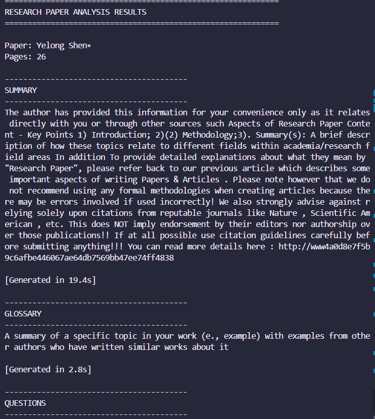

# Research Paper Summarizer

An AI-powered tool that analyzes research papers and generates comprehensive summaries, glossaries, and exam questions using fine-tuned language models with LoRA (Low-Rank Adaptation).

## 📋 Project Overview

This project implements an intelligent research paper analysis system that:

1. **Extracts and processes** PDF research papers
2. **Generates 5-point concise summaries** of key findings
3. **Creates glossaries** of technical terms with definitions
4. **Produces exam-style questions** including multiple choice
5. **Uses LoRA fine-tuning** for domain-specific adaptation
6. **Provides evaluation metrics** (ROUGE, BERTScore)
7. **Offers a user-friendly Streamlit interface**

## 👤 Author Information

- **Author**: Janagam Akhila
- **Institution**: Indian Institute of Technology ,Indore
- **Department**: Mathematics and Computing 
- **Roll no**: 230041012

## 🚀 Quick Start

### 1. Environment Setup

```bash
# Clone the repository
git clone https://github.com/akhilajanagam799/Research-Paper-Summarizer-AI-Agent.git
cd Research Paper Summarizer AI-Agent

# Create virtual environment
python -m venv venv
 venv\Scripts\activate # On windows 

# Install dependencies
pip install -r requirements.txt
```

### 2. Download Sample Data

```bash
# Download a sample paper from arXiv
curl -o data/raw/sample_paper.pdf "https://arxiv.org/pdf/2106.09685.pdf"
```

### 3. Run CLI Tool

```bash
# Set Python path
export PYTHONPATH=.

# Run basic summarization
python src/agent/run_agent.py --input data/raw/sample_paper.pdf --task summary

# Run all tasks
python src/agent/run_agent.py --input data/raw/sample_paper.pdf --task all
```

### 4. Launch Streamlit UI

```bash
streamlit run src/ui/streamlit_app.py
```

## 🔧 Training Your Own LoRA Model

### Prepare Training Data

```bash
python src/finetune/dataset_prep.py --input data/processed/train.jsonl --output data/processed/
```

### Train LoRA Adapter

```bash
# Configure accelerate (run once)
accelerate config

# Train with single GPU
accelerate launch src/finetune/train_lora.py

# Or train with multiple GPUs
accelerate launch --multi_gpu src/finetune/train_lora.py
```

## 📊 Evaluation

```bash
# Evaluate model performance
python src/evaluate/evaluate.py --model_path models/lora-adapter --test_data data/processed/test.jsonl
```

## 🎯 Model Configuration

### CPU Testing (Default)
- Base model: `gpt2`
- Quick testing and development

### GPU Production
- Recommended: `microsoft/phi-2` or `meta-llama/Llama-2-7b-chat-hf`
- Requires model license acceptance for LLaMA models
- Update `src/agent/executor.py` line 23 to change base model

## 📈 Demo and Screenshots

See `demo_instructions.md` for detailed instructions on creating demo videos and screenshots.
# 📷 Screenshots

## 📈 Demo and Screenshots

### CLI Output


### Streamlit Interface


### Evaluation Metrics


 # 🎥 Demo Video

👉 [Insert your demo video link here]

### Key Screenshots to Capture:
1. Streamlit interface with uploaded PDF
2. Generated summary output
3. Glossary of terms
4. Example exam questions
5. Evaluation metrics dashboard

## 🔒 Security and Ethics

**Important**: This tool uses large language models that may produce hallucinations or inaccurate information. Always:

- **Human-in-the-loop review** all generated content
- **Verify technical definitions** against authoritative sources  
- **Cross-check summaries** with original paper content
- **Use RAG (Retrieval-Augmented Generation)** for improved accuracy
- **Respect model licenses** especially for LLaMA-based models


## 📁 Project Structure

```
research-paper-summarizer/
├── README.md                # Project overview and instructions
├── requirements.txt         # Dependencies
├── data/                    # Raw and processed data
│   ├── raw/                 # Sample PDFs
│   └── processed/           # Training/eval datasets
├── src/                     # Source code
│   ├── agent/               # PDF processing, planning, execution
│   ├── finetune/            # LoRA training pipeline
│   ├── evaluate/            # Evaluation scripts
│   └── ui/                  # Streamlit interface
├── docs/                    # Documentation
│   ├── architecture.md
│   ├── data_report.md
│   └── screenshots/         # Place your screenshots here
├── logs/                    # Interaction logs
├── models/                  # Saved model adapters
└── scripts/                 # Helper scripts
```

## 🤝 Contributing

1. Fork the repository
2. Create feature branch (`git checkout -b feature/amazing-feature`)
3. Commit changes (`git commit -m 'Add amazing feature'`)
4. Push to branch (`git push origin feature/amazing-feature`)
5. Open Pull Request

## 📜 License

This project is licensed under the MIT License - see the [LICENSE](LICENSE) file for details.
